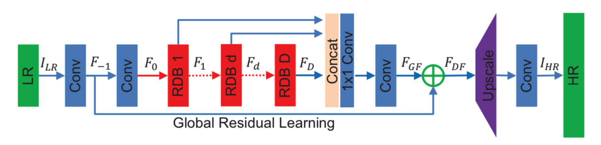
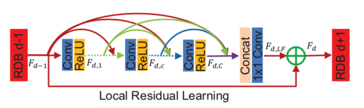

# RDN

This repository is implementation of the ["Residual Dense Network for Image Super-Resolution"](https://arxiv.org/abs/1802.08797).

<center></center>
<center></center>

## Requirements

- PyTorch 1.0.0
- Numpy 1.15.4
- Pillow 5.4.1
- h5py 2.8.0
- tqdm 4.30.0

## Train

The DIV2K, Set5 dataset converted to HDF5 can be downloaded from the links below.

| Dataset | Scale | Type | Link |
|---------|-------|------|------|
| DIV2K | 2 | Train | [Download](https://www.dropbox.com/s/41sn4eie37hp6rh/DIV2K_x2.h5?dl=0) |
| DIV2K | 3 | Train | [Download](https://www.dropbox.com/s/4piy2lvhrjb2e54/DIV2K_x3.h5?dl=0) |
| DIV2K | 4 | Train | [Download](https://www.dropbox.com/s/ie4a6t7f9n5lgco/DIV2K_x4.h5?dl=0) |
| Set5 | 2 | Eval | [Download](https://www.dropbox.com/s/b7v5vis8duh9vwd/Set5_x2.h5?dl=0) |
| Set5 | 3 | Eval | [Download](https://www.dropbox.com/s/768b07ncpdfmgs6/Set5_x3.h5?dl=0) |
| Set5 | 4 | Eval | [Download](https://www.dropbox.com/s/rtu89xyatbb71qv/Set5_x4.h5?dl=0) |

Otherwise, you can use `prepare.py` to create custom dataset.

```bash
python train.py --train-file "BLAH_BLAH/DIV2K_x4.h5" \
                --eval-file "BLAH_BLAH/Set5_x4.h5" \
                --outputs-dir "BLAH_BLAH/outputs" \
                --scale 4 \
                --num-features 64 \
                --growth-rate 64 \
                --num-blocks 16 \
                --num-layers 8 \
                --lr 1e-4 \
                --batch-size 16 \
                --patch-size 32 \
                --num-epochs 800 \
                --num-workers 8 \
                --seed 123                
```

## Test

Pre-trained weights can be downloaded from the links below.

| Model | Scale | Link |
|-------|-------|------|
| RDN (D=16, C=8, G=64, G0=64) | 2 | [Download](https://www.dropbox.com/s/pd52pkmaik1ri0h/rdn_x2.pth?dl=0) |
| RDN (D=16, C=8, G=64, G0=64) | 3 | [Download](https://www.dropbox.com/s/56topxdwm6rakwd/rdn_x3.pth?dl=0) |
| RDN (D=16, C=8, G=64, G0=64) | 4 | [Download](https://www.dropbox.com/s/yphiyivb1v7jya2/rdn_x4.pth?dl=0) |

The results are stored in the same path as the query image.

```bash
python test.py --weights-file "BLAH_BLAH/rdn_x4.pth" \
               --image-file "data/119082.png" \
               --scale 4 \
               --num-features 64 \
               --growth-rate 64 \
               --num-blocks 16 \
               --num-layers 8

```

## Results

PSNR was calculated on the Y channel.

### Set5

| Eval. Mat | Scale | RDN (Paper) | RDN (Ours) |
|-----------|-------|-------|-----------------|
| PSNR | 2 | 38.24 | 38.18 |
| PSNR | 3 | 34.71 | 34.73 |
| PSNR | 4 | 32.47 | 32.40 |

<table>
    <tr>
        <td><center>Original</center></td>
        <td><center>BICUBIC x4</center></td>
        <td><center>RDN x4 (25.08 dB)</center></td>
    </tr>
    <tr>
    	<td>
    		<center></center>
    	</td>
    	<td>
    		<center></center>
    	</td>
    	<td>
    		<center></center>
    	</td>
    </tr>
    <tr>
        <td><center>Original</center></td>
        <td><center>BICUBIC x4</center></td>
        <td><center>RDN x4 (32.98 dB)</center></td>
    </tr>
    <tr>
    	<td>
    		<center></center>
    	</td>
    	<td>
    		<center></center>
    	</td>
    	<td>
    		<center></center>
    	</td>
    </tr>      
</table>

## Citation
```
@InProceedings{Lim_2017_CVPR_Workshops,
  author = {Lim, Bee and Son, Sanghyun and Kim, Heewon and Nah, Seungjun and Lee, Kyoung Mu},
  title = {Enhanced Deep Residual Networks for Single Image Super-Resolution},
  booktitle = {The IEEE Conference on Computer Vision and Pattern Recognition (CVPR) Workshops},
  month = {July},
  year = {2017}
}

@inproceedings{zhang2018residual,
    title={Residual Dense Network for Image Super-Resolution},
    author={Zhang, Yulun and Tian, Yapeng and Kong, Yu and Zhong, Bineng and Fu, Yun},
    booktitle={CVPR},
    year={2018}
}

@article{zhang2020rdnir,
    title={Residual Dense Network for Image Restoration},
    author={Zhang, Yulun and Tian, Yapeng and Kong, Yu and Zhong, Bineng and Fu, Yun},
    journal={TPAMI},
    year={2020}
}
```
